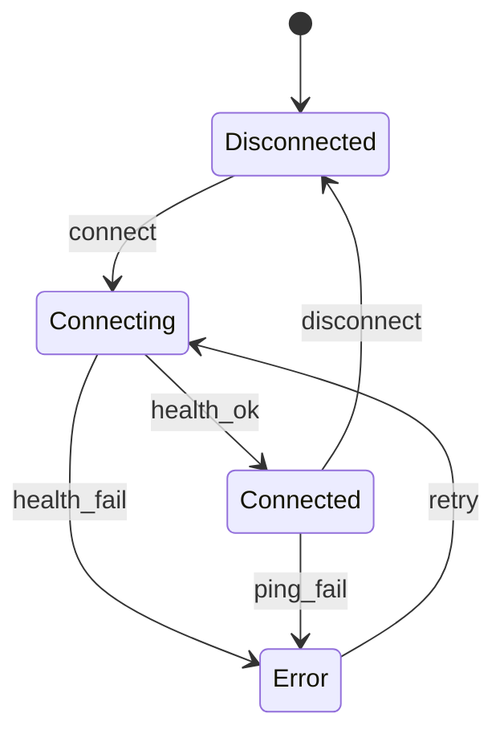

# Connection Manager Plan

## Context
- Nav bar is currently minimal and contains only the logo in [`src/components/NavBar.vue`](src/components/NavBar.vue:1).
- App shell renders the nav bar globally in [`src/App.vue`](src/App.vue:1).
- Existing data source UI may overlap with connection concerns in [`src/components/DataSourcePanel.vue`](src/components/DataSourcePanel.vue:1) and [`src/stores/dataSourceStore.ts`](src/stores/dataSourceStore.ts:1).

## Goals
- Add a connection status indicator + button in the nav bar.
- Button opens a panel/dropdown to edit IP and port or select a log file.
- Support two source modes: **Live (ZMQ)** for live DAQ connection and **Log File** for local file analysis.
- Persist IP, port, source mode, lastSeen, and error details in `localStorage`.
- Add auto-discovery if feasible, with graceful fallback to manual entry.

## Proposed Architecture
### UI Placement
- Extend [`src/components/NavBar.vue`](src/components/NavBar.vue:1) to include a right-side connection control group:
  - Status dot + text (Connected, Connecting, Disconnected, Error).
  - Button opens a dropdown panel anchored to the nav bar.
  - Panel includes:
    - **Source Mode** toggle: Live (ZMQ) / Log File
    - For Live mode: inputs for IP and port, Connect/Disconnect, and Discover action
    - For File mode: file picker for log file and optional DBC file

### Global Store
- Add a new store in [`src/stores/connection.ts`](src/stores/connection.ts:1).
- State shape:
  - `status`: idle | connecting | connected | error
  - `sourceMode`: 'live' | 'file'
  - `ip`: string
  - `port`: number
  - `filePath`: string | null
  - `lastSeen`: ISO string | null
  - `errorMessage`: string | null
  - `errorCount`: number
- Actions:
  - `loadFromStorage()`
  - `saveToStorage()`
  - `setSourceMode(mode)` — switch between live and file modes
  - `setFilePath(path)` — store selected file path
  - `connect()` and `disconnect()`
  - `ping()` for health checks (live mode only)
  - `discover()` optional (Electron-only)

### Persistence
- Persist `ip`, `port`, `sourceMode`, `lastSeen`, and `errorMessage` to `localStorage`.
- Load defaults on app start in [`src/main.ts`](src/main.ts:1) or when store initializes.

### Connection Workflow
- **Live mode**: `connect()` validates inputs, builds base URL, and hits health endpoint.
  - If health check succeeds, set `status=connected`, record `lastSeen`.
  - If it fails, set `status=error` and record `errorMessage`.
  - `ping()` runs on an interval while connected, updates status and lastSeen.
  - Retry strategy: exponential backoff capped at a max delay, with manual cancel.
- **File mode**: `connect()` validates file selection, stores file path, and sets `status=connected`.
- `disconnect()` clears status but keeps IP/port/file persisted.

### Auto-discovery Feasibility
- Pure browser discovery is constrained: network scanning and mDNS are blocked by browser security.
- Feasible approaches:
  1. **Electron main process discovery** using mDNS/bonjour libraries and IPC to renderer.
  2. **Server-side discovery** if the DAQ can broadcast or if a small local helper service exists.
- Plan: implement a `discover()` action that is **no-op in browser builds** and **enabled in Electron** via IPC.

## Required DAQ Flask Endpoints
- `GET /health` → `{ status: ok, name, version }` — Health check ping endpoint
- `GET /info` → `{ name, model, serial, apiVersion }` — Device identity (optional, used during connection)

## Telemetry / Logging Hooks
The connection store exposes built-in telemetry hooks for monitoring and debugging:

### Log Events
The store logs the following event types via `logConnectionEvent()`:
| Event Type | Payload | When |
|---|---|---|
| `connect_attempt` | `{ ip, port, timestamp }` | Before each connect call |
| `connect_success` | `{ ip, port, version, timestamp }` | After successful health check |
| `connect_error` | `{ ip, port, error, timestamp }` | On connect failure |
| `ping_success` | `{ latencyMs, timestamp }` | After successful ping |
| `ping_error` | `{ error, timestamp }` | After failed ping |
| `disconnect` | `{ reason, timestamp }` | On disconnect |
| `source_mode_change` | `{ mode, timestamp }` | When switching live/file |
| `discovery_attempt` | `{ timestamp }` | Before discovery |
| `discovery_result` | `{ results, timestamp }` | After discovery |

### Accessing Telemetry
- `getTelemetryLog()` — Returns the full array of logged events (useful for debugging/devtools)
- Events are logged to console via `console.log('[Connection]', event)` and `console.error('[Connection]', event)` for errors

### Integration Notes
- In production, forward these events to a telemetry service (e.g., Sentry, Datadog)
- The log buffer is in-memory only; persist to localStorage or remote if needed

## UX Details
- Status indicator color mapping:
  - Connected: green
  - Connecting: amber
  - Error: red
  - Disconnected: gray
- Inputs with basic validation:
  - IP: IPv4 or hostname
  - Port: 1–65535
- Show last successful connection timestamp in the panel.
- Inline validation messages for invalid IP/port or missing file selection.

## Mermaid Diagram

## Implementation Steps
1. Align nav bar layout and add connection control panel in [`src/components/NavBar.vue`](src/components/NavBar.vue:1).
2. Add a connection store in [`src/stores/connection.ts`](src/stores/connection.ts:1) with persistence logic.
3. Wire store to nav bar UI for status, inputs, and actions.
4. Add health-check ping loop and retry strategy.
5. Implement Electron-only discovery path and browser fallback.
6. Add unit tests for store actions and validation in [`src/stores/connection.test.ts`](src/stores/connection.test.ts:1).
7. Reconcile or deprecate overlapping UI/state in [`src/components/DataSourcePanel.vue`](src/components/DataSourcePanel.vue:1) and [`src/stores/dataSourceStore.ts`](src/stores/dataSourceStore.ts:1).

## Risks and Mitigations
- Discovery limitations in browser: mitigate with Electron-only discovery or manual entry.
- DAQ server availability: clear error messaging and retry controls.

## Open Decisions
- Confirm DAQ health endpoint contract and expected payload.
- Confirm Electron build is part of the target distribution.
- File mode: Define how the selected file is processed (read via FileReader API, or pass to Electron main process for file system access).
